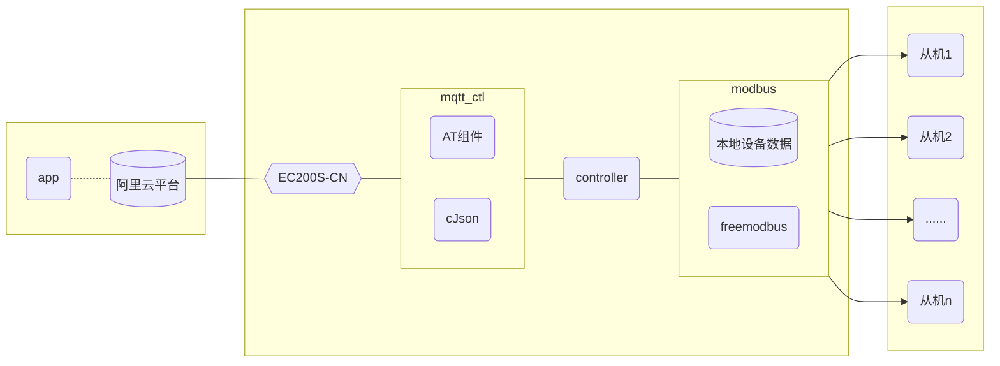

1. 验证在EC200S-CN使用MQTT连接云平台。

2. 阅读AT组件接口。

3. 在RT-Thread AT组件上编写MQTT控制层。

4. 使用cJson在应用层连接freemodbus与云平台。

```mermaid
flowchart LR
	subgraph  
		app(app)
		cloud[(阿里云平台)]
		app -.- cloud
	end
	
	cloud --- dev_ec200
	
	subgraph  
		dev_ec200{{EC200S-CN}}
	
		subgraph mqtt_ctl
			direction LR
			at(AT组件)
			cJson(cJson)
		end
	
		controller(controller)
		
		subgraph modbus
			direction LR
			local_db[(本地设备数据)]
    		mb(freemodbus)
		end
		
		dev_ec200 --- mqtt_ctl --- controller --- modbus
	end
	
	modbus --> slave1
	modbus --> slave2
	modbus --> slave_etc
	modbus --> slave_n
	
	subgraph  
		direction TB
        slave1(从机1)
        slave2(从机2)
        slave_etc(......)
        slave_n(从机n)
	end
	
	
	
	
```

   